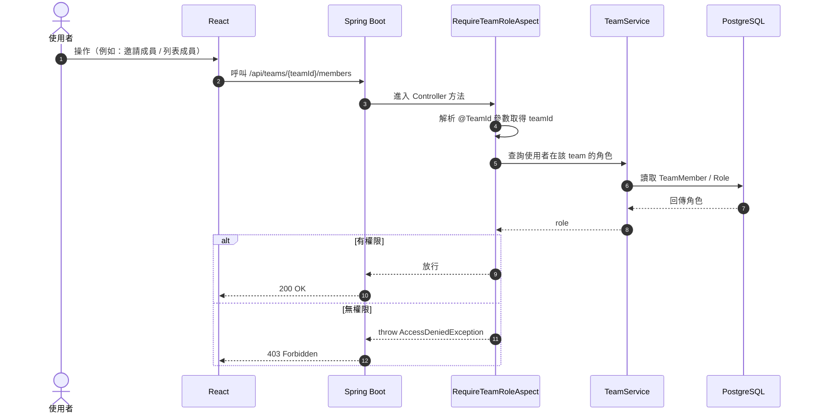
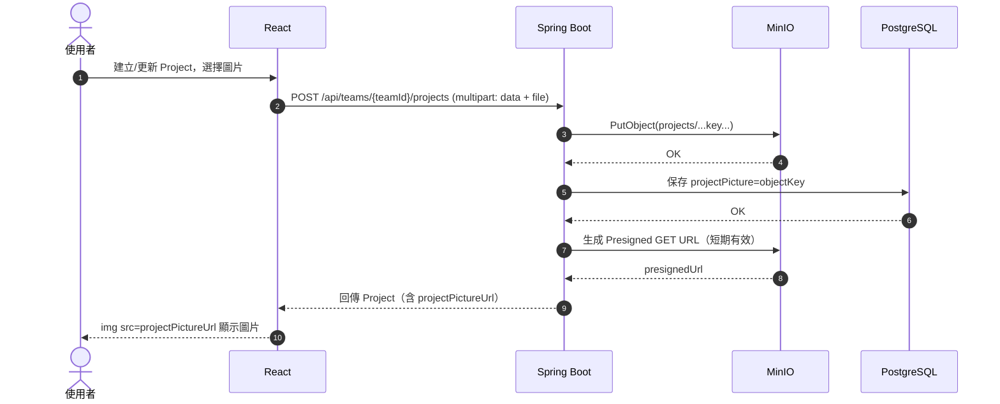
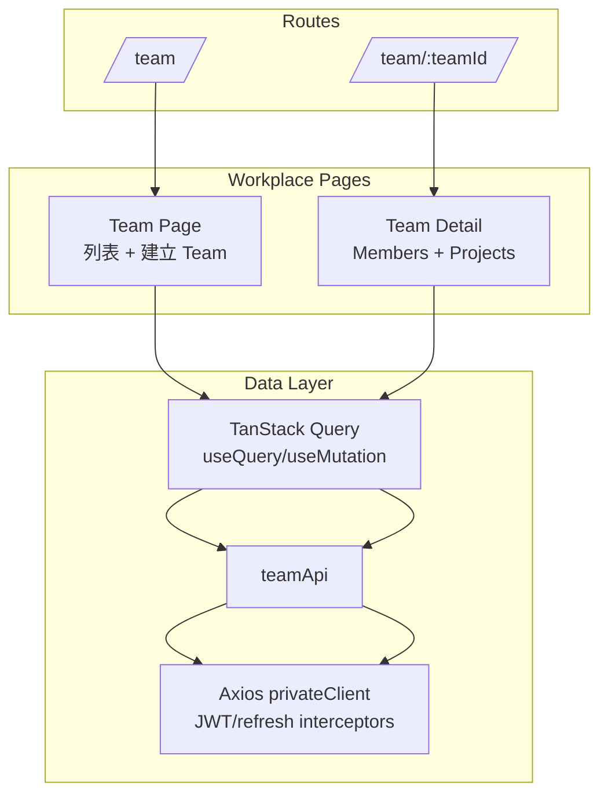

# Taskiu 架構圖（Mermaid）

本文件用 Mermaid 描述 Taskiu 的系統架構、部署拓樸與核心流程。可直接在支援 Mermaid 的 Markdown 檢視器中渲染。

## 系統拓樸（部署/網路）

```mermaid
flowchart LR
  U[使用者] --> B[瀏覽器 / React SPA]

  B -->|HTTPS| CF[Cloudflare Tunnel\ncloudflared]
  CF --> NG[Nginx Reverse Proxy\n/taskiu/*]

  NG --> FE[Frontend\n(taskiu-frontend)\n靜態資源]
  NG -->|/taskiu/api/*| BE[Backend\n(taskiu-backend)\nSpring Boot]

  BE --> PG[(PostgreSQL 16)\n核心資料]
  BE --> MG[(MongoDB 7)\nRefresh Token / 文件資料]
  BE --> RD[(Redis 7)\nCache]
  BE --> MQ[(RabbitMQ)\n事件/背景任務]
  BE --> S3[(MinIO)\nObject Storage]
  BE --> SMTP[SMTP Mail]
  BE --> OAUTH[Google / GitHub OAuth2]
```

### Nginx 路由分流
- `/taskiu/` → 前端（靜態資源 / SPA）
- `/taskiu/api/` → 後端 API

參考設定：[nginx.conf](file:///f:/taskiu/nginx.conf)、[docker-compose.yaml](file:///f:/taskiu/docker-compose.yaml)

## Backend（Spring Boot）模組關係

```mermaid
flowchart TB
  subgraph API[Controllers / REST API]
    TeamCtrl[TeamController\n/api/teams]
    ProjCtrl[ProjectController\n/api/teams/{teamId}/projects]
    AuthCtrl[Auth Controller(s)\n/api/auth/*]
  end

  subgraph AOP[Security AOP]
    TeamRoleAspect[RequireTeamRoleAspect\n@RequireTeamRole + @TeamId]
    PermAspect[PermissionAspect\n@Permission]
  end

  subgraph Service[Services]
    TeamSvc[TeamService]
    ProjSvc[ProjectService]
    AuthSvc[AuthService]
    RefreshSvc[RefreshTokenService]
    MinioProj[ProjectPictureMinioService]
    MinioBase[BaseMinioService]
  end

  subgraph Data[Repositories / Storage]
    TeamRepo[TeamRepository\n(PostgreSQL/JPA)]
    ProjRepo[ProjectRepository\n(PostgreSQL/JPA)]
    UserRepo[UserRepository\n(PostgreSQL/JPA)]
    RefreshRepo[RefreshToken Repository\n(MongoDB)]
    Cache[(Redis)]
    MQ[(RabbitMQ)]
    S3[(MinIO)]
  end

  TeamCtrl --> TeamSvc --> TeamRepo
  ProjCtrl --> ProjSvc --> ProjRepo
  AuthCtrl --> AuthSvc --> UserRepo
  AuthSvc --> RefreshSvc --> RefreshRepo

  TeamRoleAspect -.攔截/授權.-> TeamCtrl
  TeamRoleAspect -.攔截/授權.-> ProjCtrl
  PermAspect -.攔截/授權.-> API

  ProjSvc --> MinioProj --> MinioBase --> S3
  Service --> Cache
  Service --> MQ
```

重點檔案：
- Team API：[TeamController.java](file:///f:/taskiu/taskiu-backend/src/main/java/com/tavinki/taskiu/modules/teams/controller/TeamController.java)
- Project API：[ProjectController.java](file:///f:/taskiu/taskiu-backend/src/main/java/com/tavinki/taskiu/modules/project/controller/ProjectController.java)
- Team RBAC AOP：[RequireTeamRoleAspect.java](file:///f:/taskiu/taskiu-backend/src/main/java/com/tavinki/taskiu/common/aspect/RequireTeamRoleAspect.java)
- MinIO 基礎服務：[BaseMinioService.java](file:///f:/taskiu/taskiu-backend/src/main/java/com/tavinki/taskiu/common/minio/BaseMinioService.java)

## Team 權限檢查流程（@RequireTeamRole + @TeamId）



## Project 圖片上傳 + Presigned URL 顯示流程



## Frontend（React）頁面與資料流



相關檔案：
- Team 列表頁：[Team/index.tsx](file:///f:/taskiu/taskiu-frontend/src/page/workplace/Team/index.tsx)
- Team 詳情頁：[TeamDetail/index.tsx](file:///f:/taskiu/taskiu-frontend/src/page/workplace/TeamDetail/index.tsx)
- API Client：[teamApi.ts](file:///f:/taskiu/taskiu-frontend/src/api/Team/teamApi.ts)
- 路由定義：[index.tsx](file:///f:/taskiu/taskiu-frontend/src/router/index.tsx)

